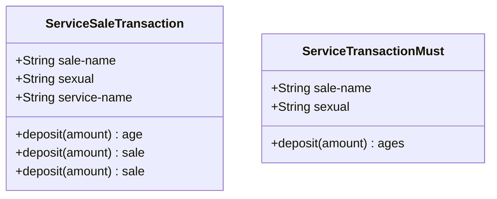
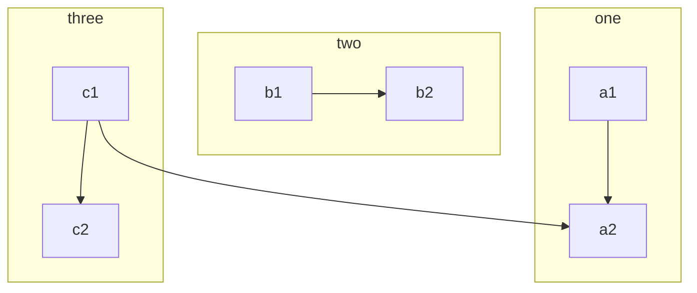

# 編集中

## 売上サンプル翻訳してみた

```mermaid

classDiagram
    class ServiceSaleTransaction
    ServiceSaleTransaction : +String sale-name
    ServiceSaleTransaction : +String sexual
    ServiceSaleTransaction : +deposit(amount) age
    ServiceSaleTransaction : +deposit(amount) sale

    class ServiceTransactionMust
    ServiceTransactionMust : +String sale-name
    ServiceTransactionMust : +String sexual
    ServiceTransactionMust : +deposit(amount) ages
    ServiceSaleTransaction : +deposit(amount) sale
    ServiceSaleTransaction : +String service-name 


```

#生ちゃん　あ、これ調律とか「原作用の赤線」作業っす。
#生ちゃん　自分用の声に調整するための資料っすね

# 

```mermaid
flowchart TB
    c1-->a2
    subgraph one
    a1-->a2
    end
    subgraph two
    b1-->b2
    end
    subgraph three
    c1-->c2
    end
```