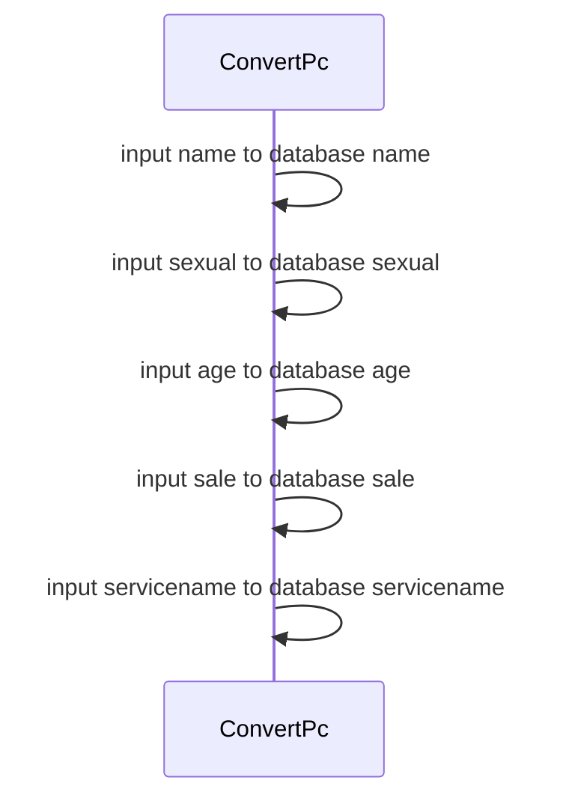
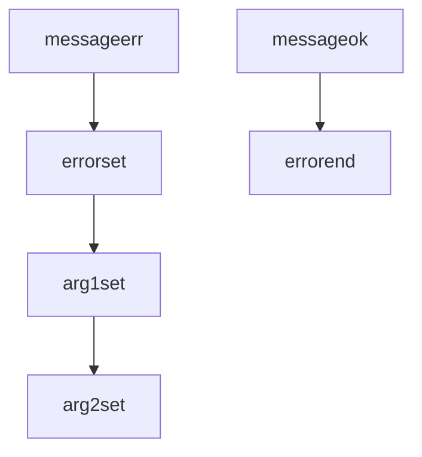
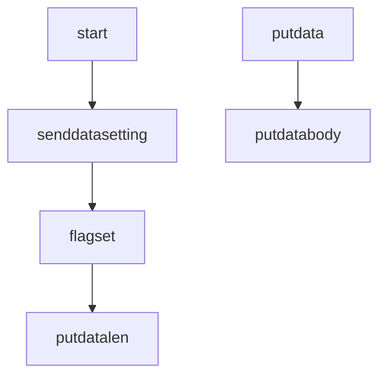
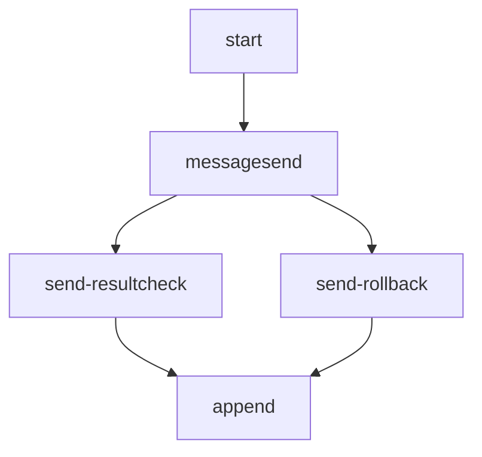
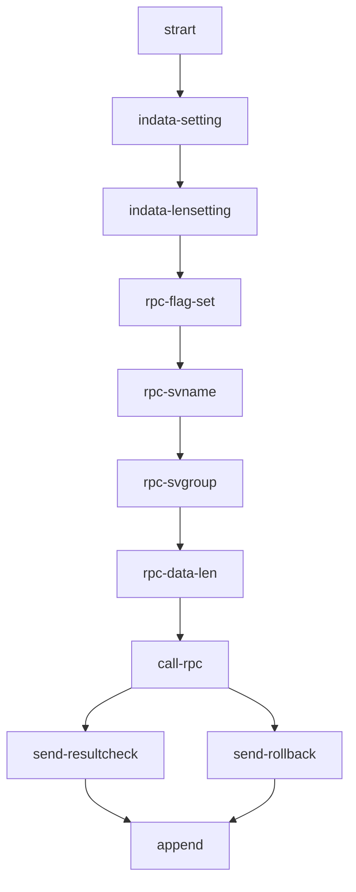

# 編集中

## 売上サンプル翻訳してみた(business program sample)

## コメント欄に記載されている、システム背景より抜粋

## コンビニ売上や、ネット決済などのサービス名が追加される(sale payment service name add tax or business)

## 売上、消費税の計算結果時のメッセージ一覧(messages)

|  メッセージID(MSGID)  |  メッセージ(Message)  |
| ---- | ---- |
|  KFSB05200-E |  SERVER:領域確保に失敗しました。  |  TD  |  TD  |
|  KFSB05300-E | SERVER:タイマトランザクション起動に失敗しました。 | 
|  KFSB05400-E | SERVER:ROLLBACKに失敗しました。 | 
|  KFSB06000-E | SERVER:DBキューのメッセージ書込みに失敗しました。 | 

## データ変換処理(cash register , e money ) → digital transaction data

## データ巻き戻し(Rollback)

## 保存処理への送信(send to message)

## データ発行

## 集計用コンピュータの呼び出し(Recmote Procedure Call)

