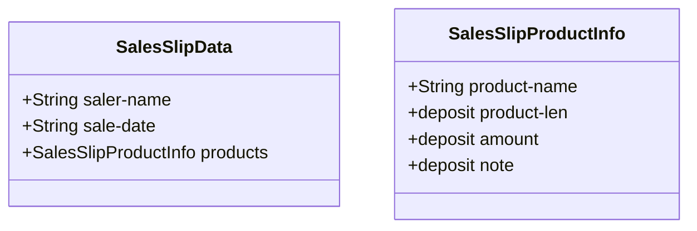
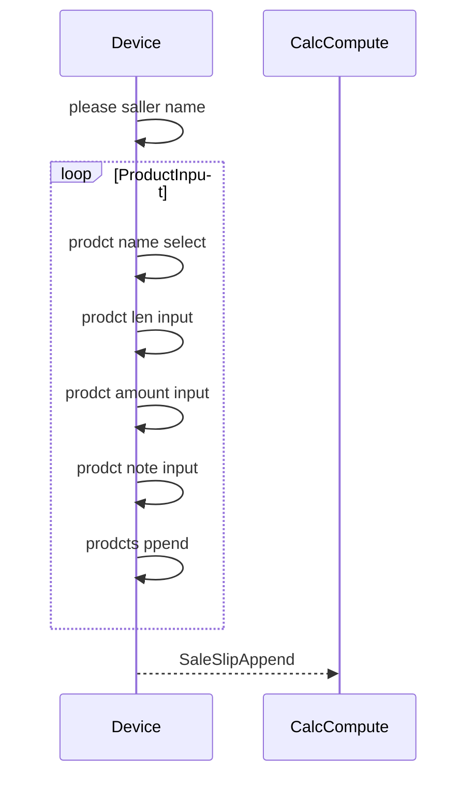
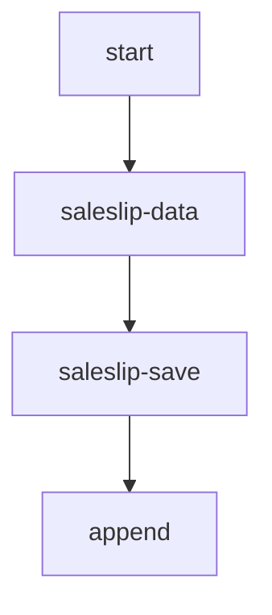

## 売上入力翻訳してみた(sale card input sample)

### 入力構造

```mermaid

classDiagram
    class SalesSlipData
    SalesSlipData : +String saler-name
    SalesSlipData : +String sale-date

    SalesSlipData : +SalesSlipProductInfo products

    class SalesSlipProductInfo
    SalesSlipProductInfo : +String product-name
    SalesSlipProductInfo : +deposit product-len
    SalesSlipProductInfo : +deposit amount
    SalesSlipProductInfo : +deposit note


```

## 売上入力処理

```mermaid
sequenceDiagram
    Device->>Device: please saller name
    loop ProductInput
        Device->>Device: prodct name select
        Device->>Device: prodct len input
        Device->>Device: prodct amount input
        Device->>Device: prodct note input
        Device->>Device: prodcts ppend
    end
    Device-->>CalcCompute: SaleSlipAppend
```

## 売上データに保存

```mermaid
flowchart TB
    start-->saleslip-data
    saleslip-data-->saleslip-save
    saleslip-save-->append
```

### インターフェース側(inter face state)

