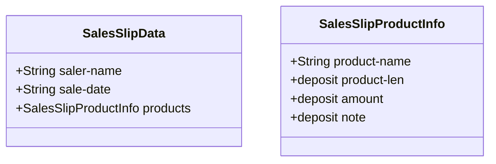
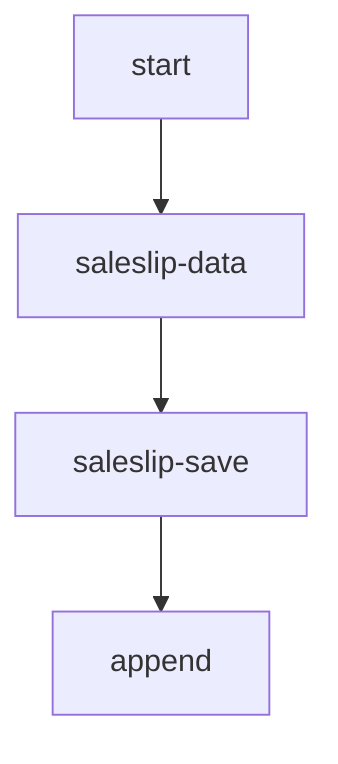

## 売上入力翻訳してみた(sale card input sample)


### 入力構造




## 売上入力処理
```mermaid
flowchart TB
    start-->saleslip-date-set
    saleslip-date-set-->saler-name-input
    loop inputend
         product-name-get
         product-name-get-->product-len-get
         product-len-get-->product-amount-get
         product-amount-get-->product-note-get
         product-note-get-->sale-slip-product-append
    end
    saleslip-data-->saleslip-save
    saleslip-save-->append
```
## 売上データに保存



### インターフェース側(inter face state)

