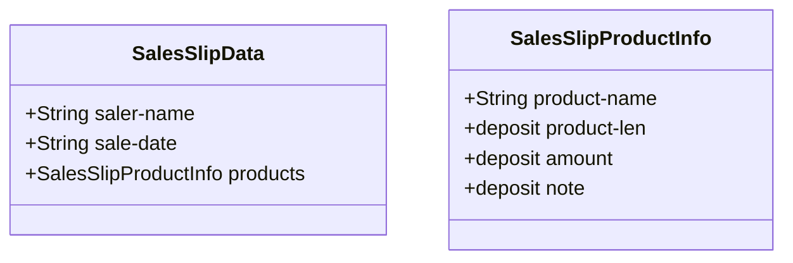
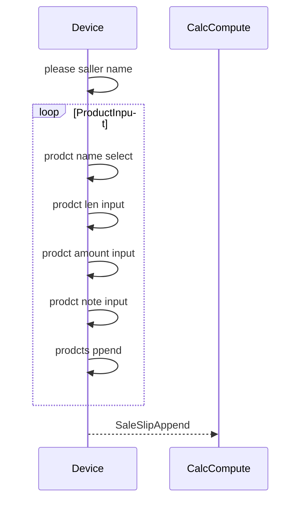
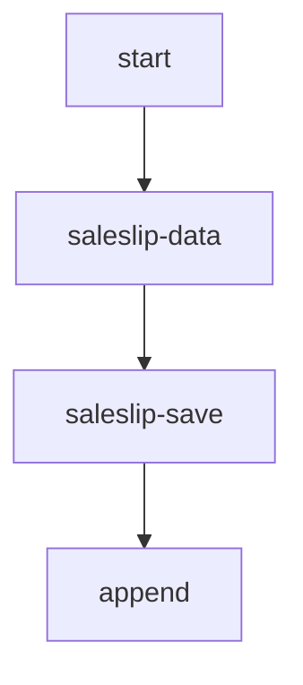

## 売上入力翻訳してみた(sale card input sample)

### 入力構造

## 売上入力処理

## 売上データに保存

### 設定値

##### 定数値一覧

|  名称  | 設定内容 |
|  taxRate |  消費税率 1を100%として1-0.01を設定  | 

## 入力ファイル

### インターフェース側(inter face state)

#### ファイル格納箇所

demo/order/interface/ に格納

#### 注文概要ファイル

##### ファイル名
sale.csv

##### ファイルデータ構造

|  列番号(1始まり)  |  名称  |
| 概要 |
| ---- | ---- | ---- |
|  1 |  購入者名  |  商品を購入した人の名前。表示名をわけないときは、アカウントidを格納 SalesSlipData.saler-name |
|  2 | 購入日時   |  商品を購入したときの日時、帳票等に出力される SalesSlipData.sale-date |

##### フォーマット説明
1.300円のアイスクリームを10個購入した時に入ってくデータ例

"アイスクリーム","10","2000","チョコミントのアイスクリームになります。"

##### フォーマット説明

#### 商品詳細ファイル

#### ファイル名
product.csv
SalesSlipProductInfoの内容が１行ずつ
設定される

##### ファイルデータ構造

|  列番号(1始まり)  |  名称  |
| 概要 |
| ---- | ---- | ---- |
|  1 |  購入商品名  |  商品の名前 "2022年チケットなど" SalesSlipProductInfo.product-name |
|  2 | 数量  |  商品を購入した数量、金額計算でも利用する SalesSlipProductInfo.product-len |
|  3 |  単価  |  商品一つあたりの単価 SalesSlipProductInfo.amount |
|  4 |  備考  |  商品そのものについての補足説明が記述される SalesSlipProductInfo.note  |

##### フォーマット説明
1.300円のアイスクリームを10個購入した時に入ってくデータ例

"アイスクリーム","10","2000","チョコミントのアイスクリームになります。"

## 出力ファイル

### ファイル名

file_result.csv

### ファイルフォーマット

売上伝票情報
購入者名 SalesSlipData.saler-name 購入日 SalesSlipData.sale-date

商品名,個数,金額,備考
products[0]
..
..
products[1]

商品合計金額 xxxxxx円 productsから算出した合計
消費税 xxxxx円 products とtax-rateから計算した合計
商品合計金額 xxxxx円 productsから計算した合計金額
合計金額 xxxxx円 商品合計金額と消費税の合計

